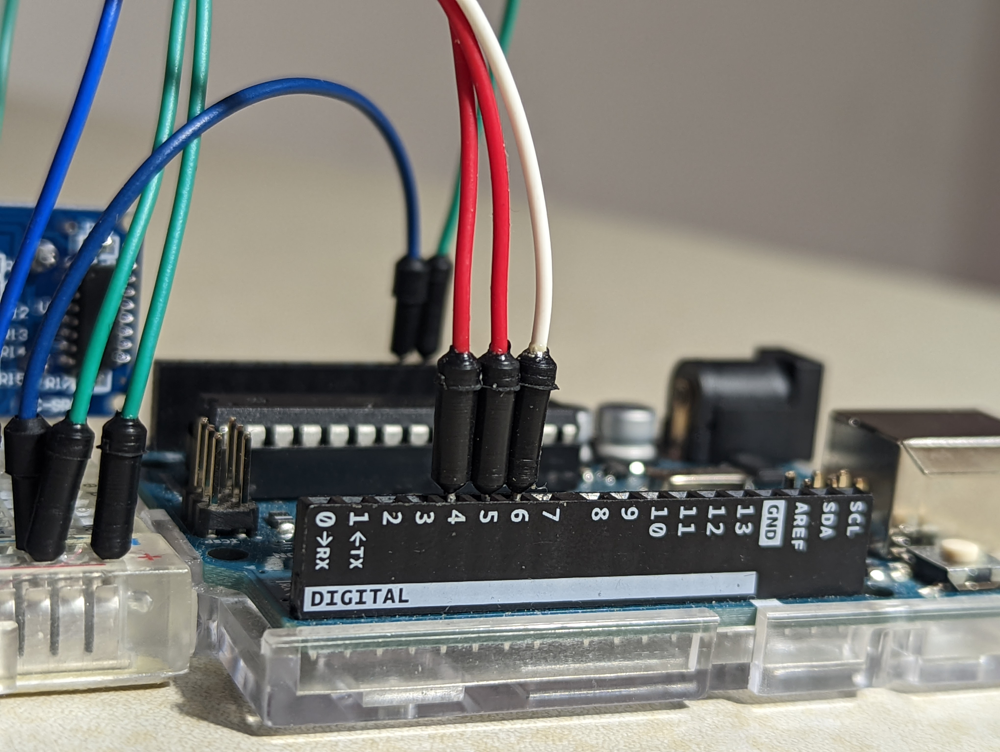
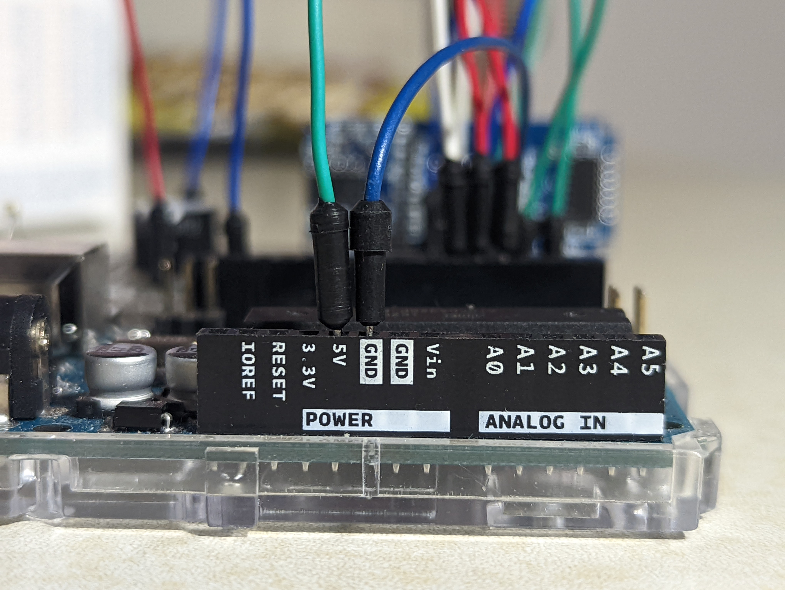
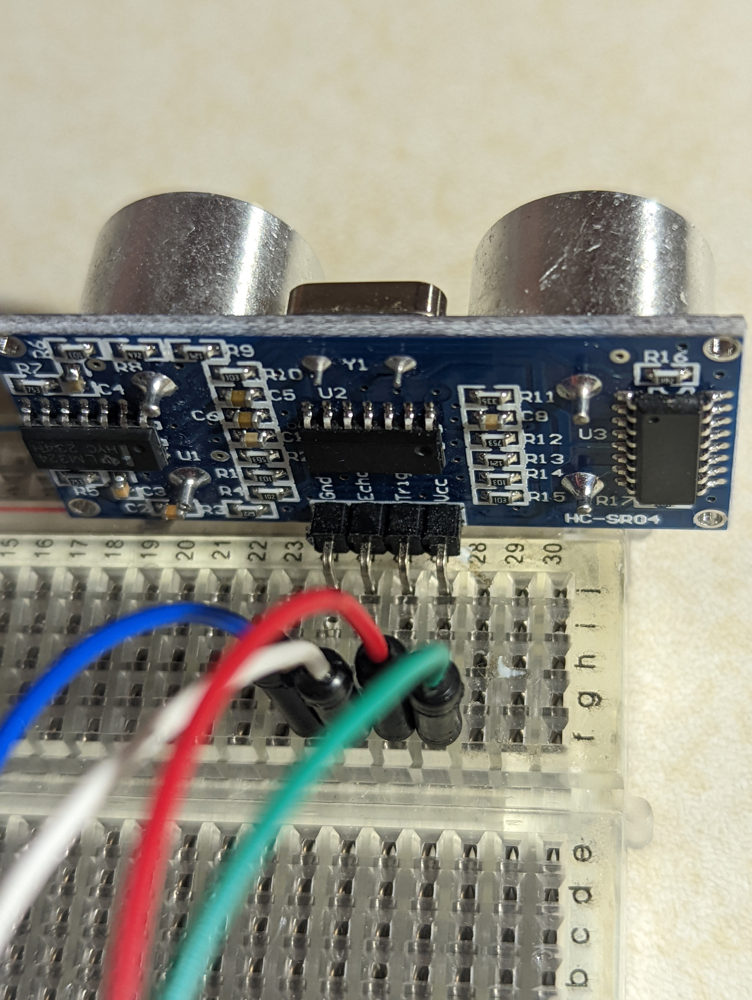
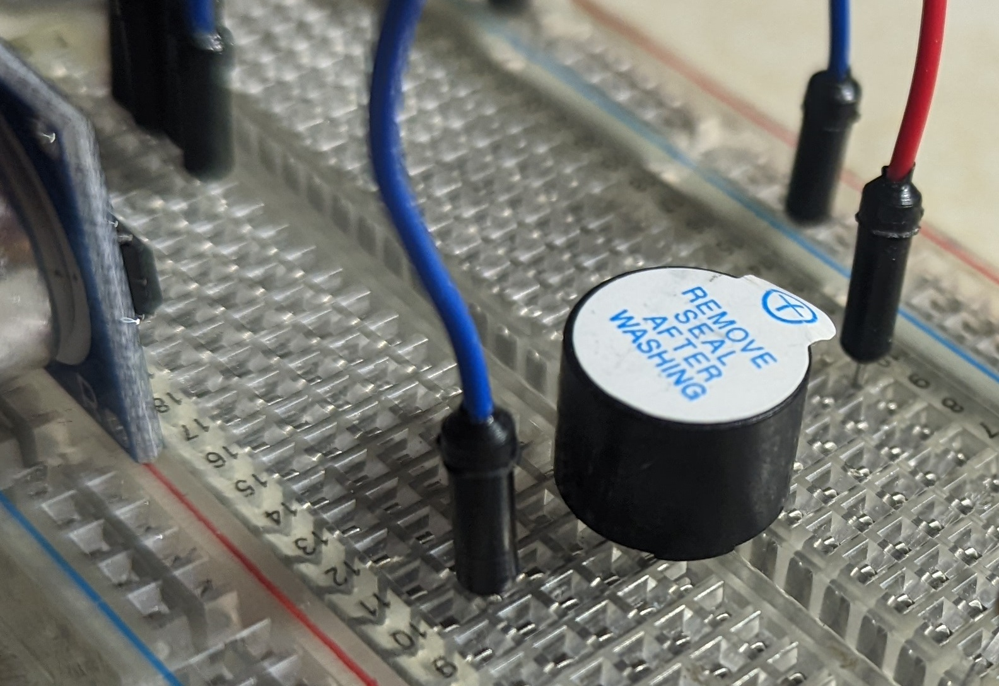

# Embedded-Systems-Parking-Assistance-System-
## Parking Assistance System using <a href="http://arduino.cc/"> "Arduino"</a> 
* The system activates as soon as it is supplied with power.   
* It is connected to a beeper which gets triggered in four different ways depending on the situation.
* Beeps with a delay of 100 milliseconds when the distance between the Ultrasonic sensor and the object is between 0-10 cm.
* Beeps with a delay of 500 milliseconds when the distance between the Ultrasonic sensor and the object is between 11-50 cm.  
* Beeps witha a delay of 1000 milliseconds when the distance between the Ultrasonic sensor and the object is between 50-100. 
* If the distance between the object and Ultrasonic sensor is above 100 cm, buzzer stops beeping.

## Hardware Used
S. No   | Hardware
------------- | -------------
1           | Arduino Uno board 
2         | USB cable for Arduino
3        | Ultrasonic sensor HC-SR04
4         | Beeper 780-0712 
5         | Breadboard
6         | 9V battery with connector
7         | Connecting wires

## Ultra sonic Sensor + Beeper connection
Arduino Pin   | Ultra sonic Sensor + Beeper connection
------------- | -------------
CYAN           | 5V or 3V   
BLUE         | GND (GROUND)
RED        | D4 (Digital Pin Four)
RED        | D5 (Digital Pin Five)
WHITE        | D6 (Digital Pin Six)

## Variables to Note
Variable Name     | What it does
------------------| -------------
distance            | **Int** that holds the value of distance in centimeters.
duration               | **Long** 
